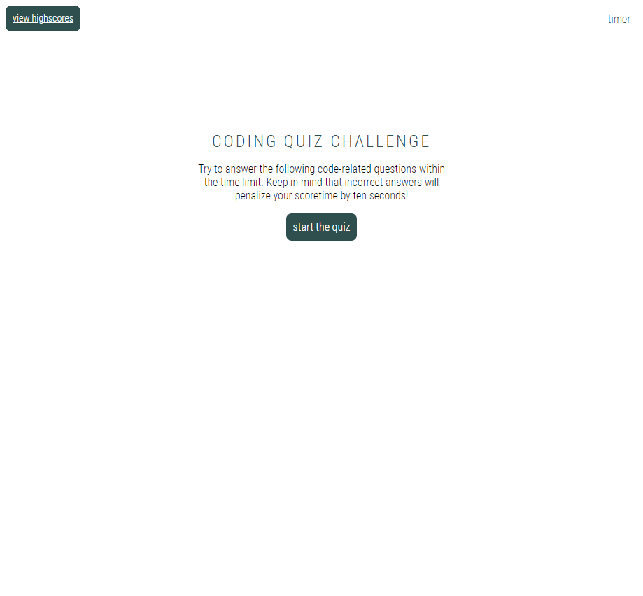
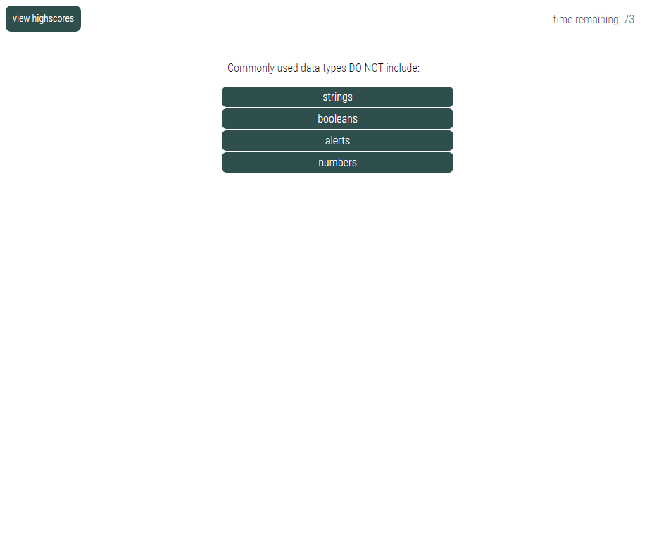
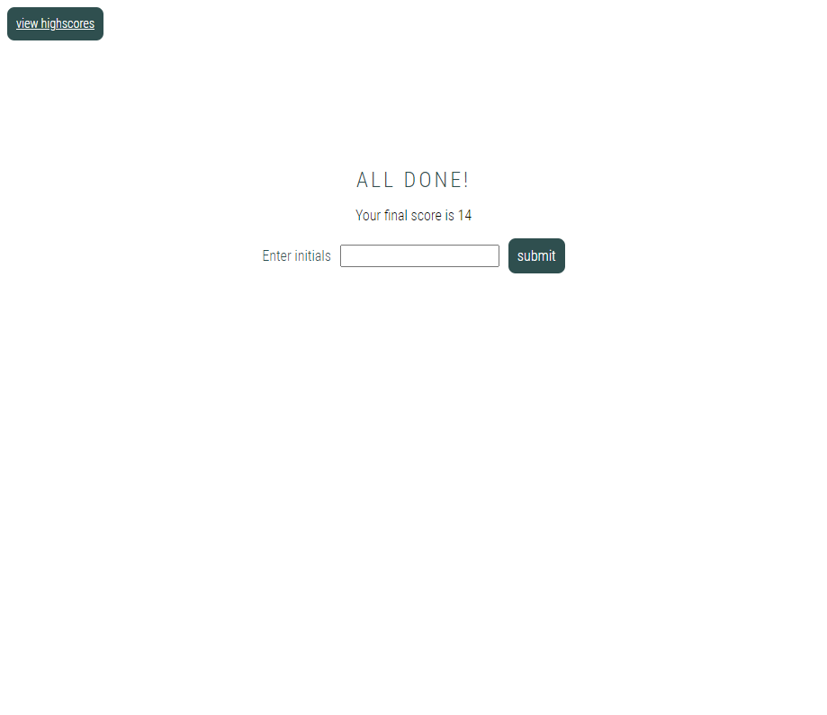
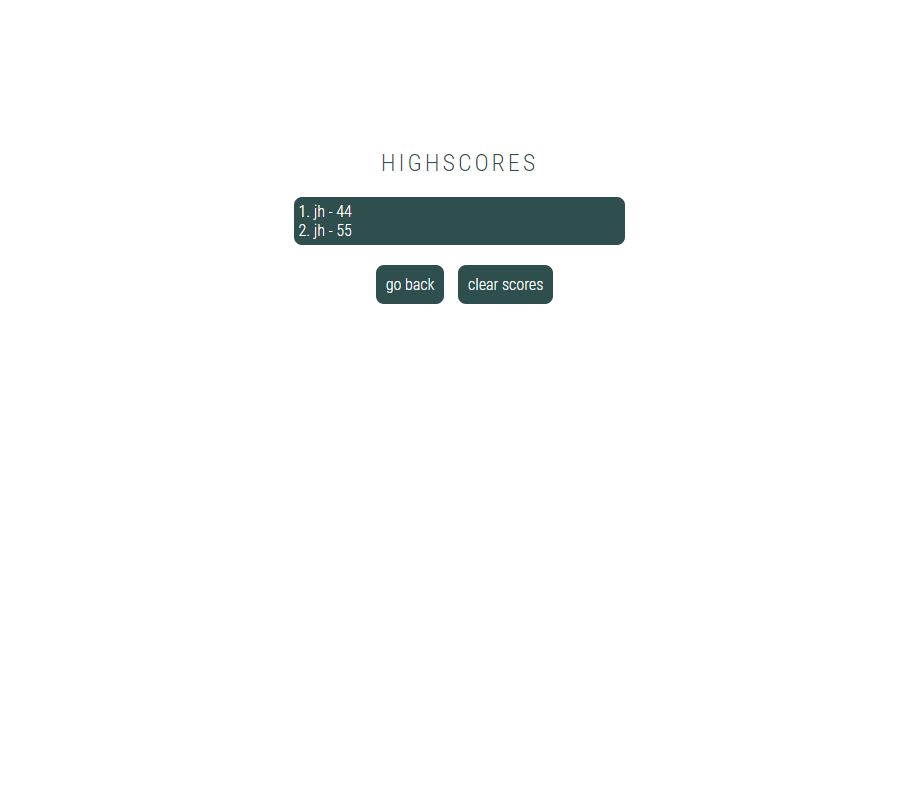

# Homework 04: Code Quiz

## Description
In this repository, you will find a timed coding quiz with multiple-choice questions. This application will run in the browser and features dynamically updated HTML and CSS powered by JavaScript code written by me. It has a clean, polished and responsive interface.

## How it works
Users are brought to a landing page that features:
* A navbar that includes a "view highscores" button and a placeholder for a timer
* The title of the application
* A brief paragraph with instructions
* A button that can be clicked to begin the quiz

There are a total of 6 multiple choice questions on this quiz, and 5 possible solutions are presented for each question. Users are provided 75 seconds to complete the quiz. The quiz is over when either all questions are answered OR the timer runs out.

Once the "start the quiz" button is clicked:
* A timer will begin, displayed in the top right corner of the browser
* The user will be presented with the first question and 5 possible solutions

Once a solution is selected:
* The next question will be displayed
* 5 new possible solutions will be provided
* The results from the previous question will be displayed

If the user answers incorrectly:
* 10 seconds will be deducted from the timer
* The next question will be displayed

When the quiz is complete, an end page will be displayed. The end page features:
* A heading that says "ALL DONE!"
* The user's final score
* A form prompting the user to enter their initials
* A submit button

If the user fails to enter their initials:
* "No value entered" will be logged to the console
* They will receive an alert that states "Please enter your initials"

If the user enters their initials, they will be redirected to the Highscores page that features:
* All highscores pulled from the user's local storage
* A button to go back to the homepage
* A button to clear stored highscores

## Mock-Up
The finished project can be deployed [here](https://jaccihorvath.github.io/code-quiz/index.html).

### Demo

### Landing Page

### Question Sample

### End Page

### Highscores Page

